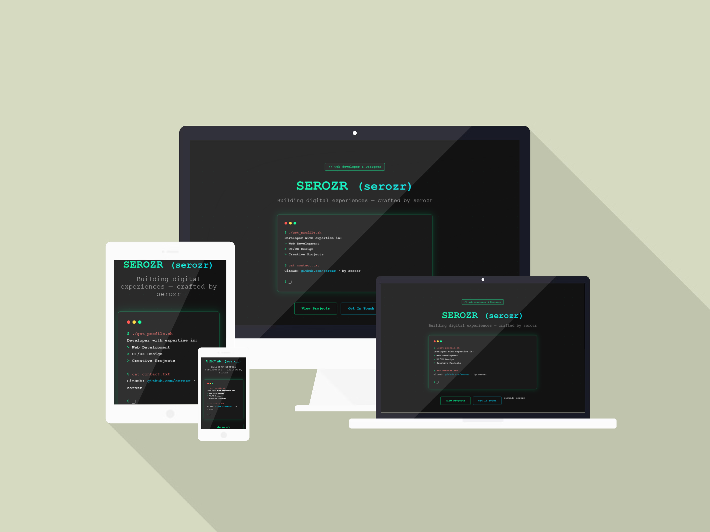

<h2 align="center">
  Minah Nguyen — Cybersecurity & IT Portfolio
<br/>
  <a href="https://honeybeemin.github.io/minah-portfolio/" target="_blank">
View Live Portfolio
</a>

</h2>
<div align="center">
  

</div>
<center>

[](https://forthebadge.com) &nbsp;
[](https://forthebadge.com) &nbsp;

&nbsp;


</center>

---

## About Me

Cybersecurity and IT student with hands-on experience in security labs,
networking fundamentals, cloud concepts, and data-driven projects.
This portfolio highlights my technical skills, certifications,
and projects as I prepare for cybersecurity and IT internship roles.

## ✨ Portfolio Highlights


This site is based on a terminal/cyber-themed portfolio template that I customized with my content (projects, skills, experience, and links).  
The template includes modern UI effects and JavaScript interactions to create a clean, interactive experience.

### What I customized
- Updated all content to reflect my cybersecurity & IT background
- Added my projects, certifications, and links
- Edited layout sections and styling to match my brand
- Maintained responsive behavior for mobile and desktop

### 🎨 Design & UI
- **Terminal Boot Screen** - Immersive boot sequence animation on page load
- **Cyberpunk Aesthetic** - Neon green (#00FF8C) and cyan (#00D9FF) color scheme
- **Glassmorphism Effects** - Modern transparent card designs with backdrop blur
- **Smooth Animations** - Intersection Observer API for scroll-triggered animations
- **Responsive Design** - Mobile-first approach, works on all devices

### 🛠️ Technical Features
- **Pure Vanilla JavaScript** - No frameworks or libraries required
- **CSS Grid & Flexbox** - Modern layout techniques
- **Custom Animations** - Handcrafted CSS keyframe animations
- **Lazy Loading** - Performance-optimized content loading
- **Smooth Scrolling** - Enhanced navigation experience
- **Interactive Elements** - Hover effects and transitions throughout

### 📱 Sections
- **Hero** - Welcome section with terminal window
- **About** - Personal introduction with statistics and code snippet
- **Skills** - Categorized skill sets with animated progress bars
- **Experience** - Professional journey timeline
- **Education** - Academic background timeline
- **Certifications** - Achievements and awards showcase
- **Projects** - Portfolio of featured work
- **Blog** - Latest articles and posts
- **Contact** - Interactive contact form and social links

---

## Running the Portfolio Locally

If you’d like to explore or modify this portfolio locally, follow the steps below.

### Prerequisites
- A modern web browser (Chrome, Firefox, Safari, Edge)
- VS Code or any text editor
- Optional: Local web server (Live Server or Python)

### Setup

1. **Clone the repository**
   ```bash
   git clone https://github.com/Honeybeemin/minah-portfolio.git
   cd minah-portfolio

   ```

2. **Open in browser**
   
   **Option A: Direct File Access**
   ```bash
   # Simply open index.html in your browser
   # Windows
   start index.html
   
   # macOS
   open index.html
   
   # Linux
   xdg-open index.html
   ```

   **Option B: Local Server (Recommended)**
   ```bash
   # Using Python 3
   python -m http.server 8000
   
   # Using Node.js (http-server)
   npx http-server
   
   # Using VS Code Live Server extension
   # Right-click on index.html and select "Open with Live Server"
   ```

3. **Navigate to**
   ```
   http://localhost:8000
   ```

---

## Project Structure

```
cyber-portfolio/
│
├── index.html            # Main HTML entry point
├── LICENSE               # MIT License
├── README.md             # Project documentation
│
└── src/                  # Source files
  ├── assets/           # Static assets
  │   └── images/       # Image files
  │
  ├── css/              # Stylesheets
  │   ├── animations.css # Custom animation keyframes
  │   └── main.css       # Main stylesheet
  │
  └── js/               # JavaScript files
    └── main.js        # Interactions and animations
```

---

## Customization Guide

### Changing Colors

Edit the CSS variables or colors directly in `src/css/main.css`:

```css
/* Primary accent color - Neon Green */
#00FF8C

/* Secondary accent color - Cyan */
#00D9FF

/* Background color */
#121212

/* Card background */
rgba(26, 26, 26, 0.8)
```
---

## Customizing the Portfolio

This portfolio is built on a customizable template that I adapted for my
cybersecurity and IT background. The structure allows easy updates to content
and layout without changing the core design.

### Content Updates
- **Personal Information**: Update text and sections in `index.html`
- **Skills & Experience**: Edit listed skills, certifications, and experience
- **Projects**: Add or update projects showcased in the portfolio
- **Contact Information**: Modify social links and contact details

### Layout Adjustments
- Layout and styling can be adjusted through the CSS files in `src/css/`
- Minor behavior changes can be made in the JavaScript files under `src/js/`

## Browser Support

This portfolio is designed to work on all modern browsers.

- Chrome
- Firefox
- Safari
- Edge

*Internet Explorer is not supported.*

---

## Performance & Accessibility

This portfolio prioritizes a clean, responsive user experience using
modern web standards. Performance and accessibility considerations are
handled through lightweight design choices and browser-native features
provided by the underlying template.

Formal performance audits (e.g., Lighthouse) can be run as needed.

---

## Built With

- **HTML5** – Semantic structure
- **CSS3** – Layout and visual styling
- **JavaScript (Vanilla)** – Client-side interactivity

---

## Future Improvements

- Continue refining content and projects
- Add additional cybersecurity-focused work and labs
- Improve accessibility and usability as the portfolio evolves

---

## License

This project is licensed under the MIT License - see the [LICENSE](LICENSE) file for details.

---

## Author

**Minah Nguyen**

- GitHub: [@Honeybeemin](https://github.com/Honeybeemin)
- Portfolio: https://honeybeemin.github.io/minah-portfolio/
---

## Acknowledgments

- Portfolio template and design inspiration from open-source community resources
- Visual styling influenced by terminal-based and cyber-themed interfaces
- Open-source tools that support learning and experimentation

--- 


<div align="center">
  

</div>
